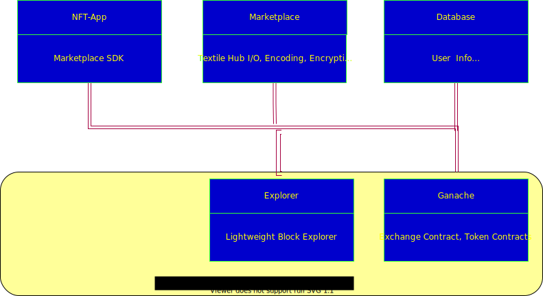

# Video NFT Devnet

## Quick start
checkout the repo, get the submodules and run the docker-compose.
```
git submodule update --init --recursive
```
Update the docker-compose to lattest vetsion(v1.29.1)  
https://docs.docker.com/compose/install/


Get your textilehub credentials and update marketplace_env.list  
https://docs.textile.io/hub/apis/
```
MARKETPLACE_TEXTILE_AUTH_KEY=""
MARKETPLACE_TEXTILE_AUTH_SECRET=""
MARKETPLACE_TEXTILE_THREAD_ID=""
MARKETPLACE_TEXTILE_BUCKET_ROOT_KEY=""
```

Run the Video NFT Devnet

```
docker-compose up
```

Open the browser and launch the aft-app.
```
http://localhost:8080/
```

Use the follwing test private-key in Metamask with "Localhost 8545" Netowork
```
Private Key: 4f3edf983ac636a65a842ce7c78d9aa706d3b113bce9c46f30d7d21715b23b1d
Account: 0x90F8bf6A479f320ead074411a4B0e7944Ea8c9C1

```

Open Lightweight Block Explorer
```
http://localhost:8090/
```

Bringdown the Video NFT Devnet
```
docker-compose down -v
```
Note: If you are going run the video-nft-devnetwork again (docker-compose up), flush your browser cache to remove the stale authentication of nft-app from the previous session.

## VideoNFT Marketplace Components
Docker-compose based devnet that includes the following services:
* NFT-APP(Video NFT Frontend)
* Marketplace(API Backend)
* Postgres(Database for userinfo)
* Ganache(Blockchain Devnet)
* Explorer(Lightweight Block Explorer)
* Token Contracts(Contract deployer)




The above components are configurable. The Video NFT GUI installer obtains the configuration parameters and configures the components. The configuration options of each component are listed below for reference.

## nft-app
VideoCoin NFT Frontend

Environment Variables
```
REACT_APP_BASE_URL=
REACT_APP_NETWORKS=
REACT_APP_TOKEN_ADDRESS=
```
## Marketplace
This service provides the backend API for the VideoCoin NFT.

Testing the service docker image:

### Obtain TextileHub credentials
https://docs.textile.io/hub/apis/

### Configure Marketplace
Example environment variables file (env.list)
```
MARKETPLACE_TEXTILE_AUTH_KEY=
MARKETPLACE_TEXTILE_AUTH_SECRET=
MARKETPLACE_TEXTILE_THREAD_ID=
MARKETPLACE_TEXTILE_BUCKET_ROOT_KEY=
MARKETPLACE_BLOCKCHAIN_URL=
MARKETPLACE_ERC1155_CONTRACT_ADDRESS=
MARKETPLACE_ERC1155_CONTRACT_KEY=
MARKETPLACE_ERC1155_CONTRACT_KEY_PASS=
```

## Ganache
Test network.
It can removed by providing Web3 provider for Mainnet or any testnet to the marketplace.

Note: We launch ganache with deterministic address option where the same test account addresses are created for every session. The value for the environment variable MARKETPLACE_ERC1155_CONTRACT_ADDRESS supplied for marketplace is also dertermenistic. 
## Token Contracts
Environment variables:
```
VID_PRIV_KEY=""
VID_RPC=http://localhost:8545
ERC1155_TOKEN_URI_TEMPLATE="https://hub.textile.io/ipns/<MARKETPLACE_TEXTILE_BUCKET_ROOT_KEY>/1.json"
```

## Explorer
An open source Lightweight Block Explorer
It can show the status of blockchain and can be replaced with any Ethereum blockchain. It is useful if a local test chain such as Ganache is used.

https://github.com/Alethio/ethereum-lite-explorer